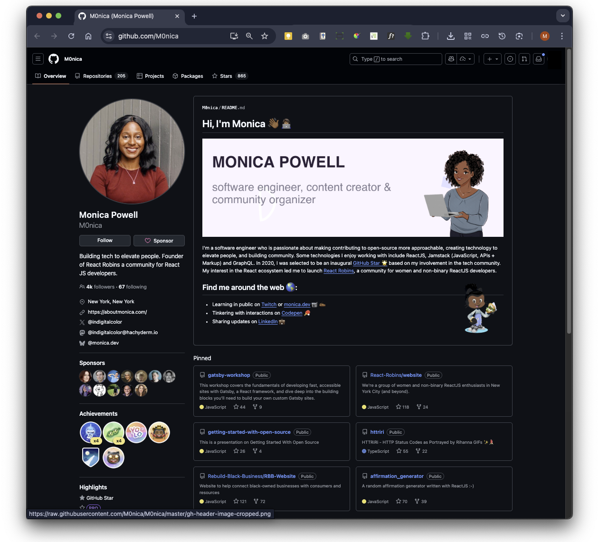
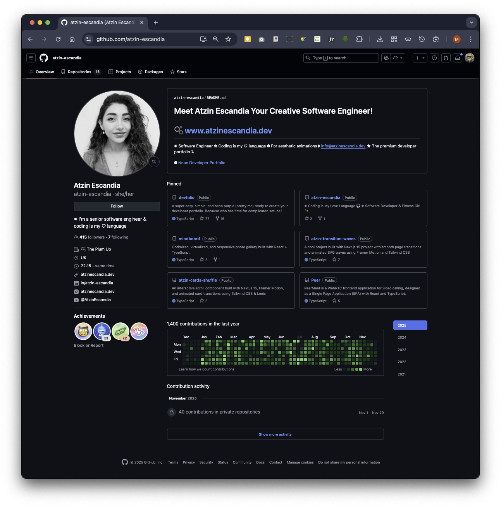
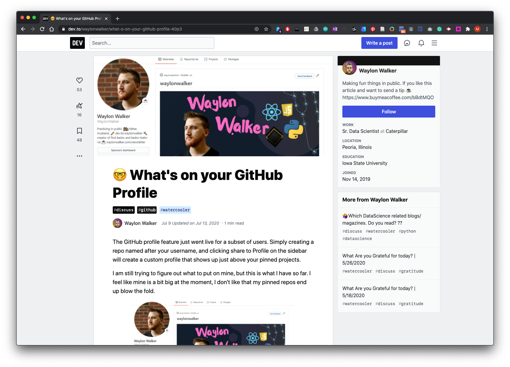
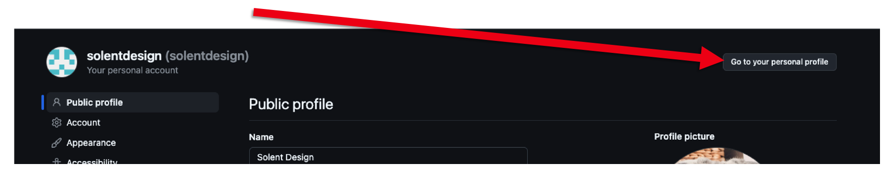
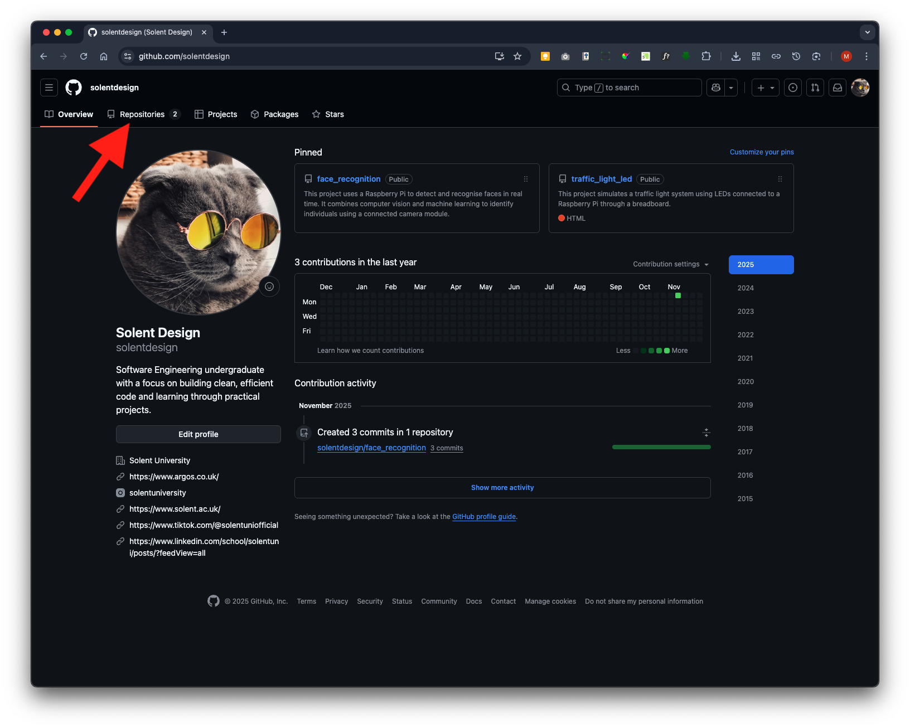
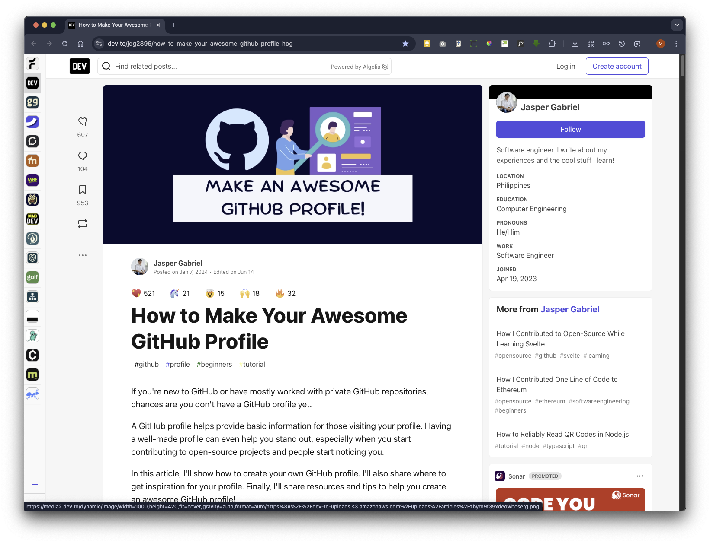

# Step-by-Step Guide to Optimising Your GitHub Profile


## Overview

A strong professional GitHub profile presents you as a skilled and active developer. It should include complete details such as a clear photo, a concise bio, and links to your portfolio or LinkedIn. Pin your best repositories that showcase clean, well-documented code and meaningful projects. Each project should have a detailed README explaining its purpose, setup instructions, and technologies used. Consistent activity through commits and contributions signals engagement, while professional practices such as clear commit messages, tests, and organised code demonstrate quality. Highlight collaboration by contributing to open-source or team projects, and make use of GitHub features like tags and actions to improve visibility and automate workflows.

Below are two examples of good professional GitHub profiles:

**Example 1:**

**POWELL.,M. 2025.** *M0nica - Overview* [viewed 21 March 2025]. Available from: [https://github.com/M0nica](https://github.com/M0nica)




**Example 2:**

**ESCANDIA, A., 2025.** Atzin-escandia - Overview [viewed 29 November 2025]. Available from: [https://github.com/atzin-escandia](https://github.com/atzin-escandia)




#### Avoid having a GitHub Profile that makes you look like a Bot!

When it comes to your GitHub profile, it's essential to strike a balance between showcasing your skills, projects, and contributions while maintaining professionalism and privacy. 

<p align="center">
<iframe src="https://solent.cloud.panopto.eu/Panopto/Pages/Embed.aspx?id=7e152607-fc61-49a7-8de4-b2e3008a6a05&autoplay=false&offerviewer=true&showtitle=true&showbrand=true&captions=true&interactivity=all" height="405" width="720" style="border: 1px solid #464646;" allowfullscreen allow="autoplay" aria-label="Panopto Embedded Video Player" aria-description="Creating Professional GitHub Profile" ></iframe>
</p>

[Download GitHub Profile Slides](GitHub_Profile_2025.pptx)

Here are some dos and don'ts for what information to include on your GitHub profile.

**Do:**
1. **Professional Profile Picture:** Use a professional photo or avatar that represents you well in a work context.

1. **Bio/Description:** Write a brief, informative bio highlighting your expertise, interests, and contributions. Keep it concise and relevant.

3. **Repositories:** Publicly showcase your best projects, contributions, and code samples. Organise them with clear descriptions and README files.

4. **Contributions:** Make you sure you are showing that you are “active” in the Contributions panel either for personal and joint project.

5. **Skills:** Include a list of relevant skills and technologies you're proficient in. This helps others quickly assess your expertise.

6. **Contact Information:** Provide ways for others to contact you, such as an email address or social media profiles.

7. **Open Source Contributions:** Mention any open-source projects you maintain or actively contribute to. This showcases your commitment to collaboration and community building.


**Don't:**
1. **Sensitive Information:** Avoid including sensitive personal information such as your home address, phone number, or personal email address.

1. **Confidential Code:** Refrain from uploading proprietary or confidential code to public repositories. Be mindful of intellectual property rights and confidentiality agreements.

1. **Incomplete or Untidy Repositories:** Keep your repositories organised and well-documented. Avoid leaving unfinished or messy projects on your profile.

1. **Unprofessional Content:** Do not share content that could be considered offensive, discriminatory, or unprofessional. Remember that your GitHub profile is a reflection of your professional image.

1. **Overly Personal Details**: While it's fine to mention hobbies or interests, avoid oversharing personal details that are unrelated to your professional profile.

1. **Negative Remarks:** Avoid making negative remarks about previous employers, colleagues, or projects. Maintain a positive and constructive tone in your interactions and contributions.

1. **Inactive or Outdated Content:** Regularly update your profile with recent projects and contributions. Avoid leaving outdated or inactive content that doesn't reflect your current skills and expertise.


See more examples here: **WALKER.,W. 2025.** *What’s on your GitHub Profile* [viewed 21 March 2025]. Available from: [https://dev.to/waylonwalker/what-s-on-your-github-profile-40p3](https://dev.to/waylonwalker/what-s-on-your-github-profile-40p3)




<p style="text-align: center;">
<iframe width="560" height="315" src="https://www.youtube.com/embed/-otyb0ngsa4?si=NNUL99XaeIm2zib0" title="YouTube video player" frameborder="0" allow="accelerometer; autoplay; clipboard-write; encrypted-media; gyroscope; picture-in-picture; web-share" allowfullscreen="" style="font-size: 1rem;"></iframe>
</p>

<p style="text-align: center;">
<iframe width="560" height="315" src="https://www.youtube.com/embed/vNoPWpF3zJk?si=-epA2T9B2twvTRZq" title="YouTube video player" frameborder="0" allow="accelerometer; autoplay; clipboard-write; encrypted-media; gyroscope; picture-in-picture; web-share" allowfullscreen="" style="font-size: 1rem;"></iframe>
</p>

<p style="text-align: center;">
Link to recourse mention in this video:&nbsp;<a href="https://www.profileme.dev/create-profile">profileme.dev/create-profile</a>
</p>

<p style="text-align: center;">
<iframe width="560" height="315" src="https://www.youtube.com/embed/ktN5tDfQ_g8?si=ArLr8_EjJN2TH-Zb" title="YouTube video player" frameborder="0" allow="accelerometer; autoplay; clipboard-write; encrypted-media; gyroscope; picture-in-picture; web-share" allowfullscreen="" style="font-size: 1rem;"></iframe>
</p>

## Fix Your GitHub Profile Walk-through

**This walkthrough assumes you already have a basic understanding of GitHub, have set up your profile, and created repositories. It also assumes you have some basic knowledge of Markdown scripting.**


### 1. The First Impression: Perfecting Your Profile Header 

Your GitHub profile is far more than just a place to store code; it's a dynamic, professional portfolio. For potential employers, it’s a window into your skills, the projects you've built, and your passion for technology. It's a powerful tool for building your career and demonstrating your enthusiasm for digital projects.

Unfortunately, it's common for students to create a profile for a module or course and then leave it incomplete. This guide will walk you through simple but powerful steps to turn that dormant profile into a compelling showcase of your talent, one that opens doors to new opportunities.

The very top of your profile, your avatar, name, bio, and links, creates an immediate first impression for any visitor. Getting these details right is the first step toward a professional and compelling presence.

**1.1. Update Your Avatar -** A generic, default avatar can make a profile look incomplete. Replacing it is a small change with a big impact. Your goal is to use *something* other than the default. You have a few great options:

- **Use a professional-looking picture of yourself.** This adds a personal and human touch.

- **Use an AI-generated or cartoon picture.** If you aren't comfortable using a personal photo, this is an excellent alternative that still shows personality.


#### 1.2. Set Your Name and Write a Bio 

By default, GitHub may only display your username, which can be cryptic. Change this to your full name so visitors know who you are.

Next, write a short bio that provides essential context. It doesn't need to be long, but it should be informative. Consider including:

- **What you are studying:** Something like "Computer Science Student" is perfect. You can choose to omit your specific university if you prefer.

- **Your areas of interest:** Mention your passions within technology to give a sense of what drives you.


#### 1.3. Add Strategic Links 

Links are a powerful way to direct visitors to more of your work and professional presence. Be strategic about what you share.

1.  **Portfolio Website:** A personal portfolio is the best way to showcase your work in one place. You can easily create a simple portfolio website and host it for free using **GitHub Pages**.

2.  **Professional social media:** Avoid linking to private social media accounts. Instead, create professional accounts dedicated to highlighting your work, sharing what you're learning, and engaging with the tech industry.


Scroll down and click Update profile 


Then at the top of the page click



All done!


### 2. Curating Your Best Work: Pinning Repositories 

Pinning repositories allows you to take control of your profile's narrative. Instead of letting GitHub display your most popular or recent projects by default, you can hand-pick the ones that best represent your skills and ambitions.

#### 2.1. Why Pinning Matters

Pinning allows you to strategically highlight your standout projects. It’s your opportunity to curate a collection that shows a variety of your skills and tells a compelling story about your abilities, rather than just showing what's most recent.

#### 2.2. How to Select and Pin Your Projects

 Carefully choosing which projects to feature is key. Follow this strategy to build an impressive showcase:

1.  **Aim for Quality:** Choose **four to six** of your standout projects that best demonstrate your abilities.

2.  **Showcase Variety:** Select projects that highlight different skills and technologies you've worked with.

3.  **Include Side Projects:** Pinning projects, you've built outside of class is the most powerful signal you can send to employers. It shows you are **"doing more outside your class time"** and provides concrete proof that you are **"motivated and willing to learn."** Most importantly, it demonstrates **"independent learning beyond what you're doing in your modules"**, a quality that every employer is looking for.

4.  **Arrange by Importance:** After pinning your repositories, you can drag and drop them to change their order. Place your most impressive project first.


### 3. Project Polish: The Three Essentials for Every Repository 

Once a repository is pinned, it needs to be clear, professional, and easy for an outsider to understand. Every featured project should have these three essential components.

#### 3.1. Use a Meaningful Repository Name 

A project named final-project-v2 tells a visitor nothing. The repository's name should clearly reflect its content.

To change it, go to the repository's **Settings** tab and find the **Repository name** field. Update it to something descriptive, using underscores or hyphens instead of spaces (e.g., face-recognition-app).

#### 3.2. Write a Clear One-Line Description 

The short description appears directly under the repository name on your main profile page. It provides a quick summary of what the project does.

1.  Navigate to the main page of your repository.

2.  Click the small **cog icon** next to the "About" section on the right-hand side.

3.  In the **"Description"** field, write a concise, one-sentence summary of the project.

4.  Optionally, add a **"Website"** link. This is the perfect place to link to a live demo, especially if the project is hosted on GitHub Pages.

In the about section click the cog icon


Type in a short project description. And click save changes


You will see the description top left 


#### 3.3 Craft a Comprehensive README File 

The **README** is the most critical piece of documentation for any project. Its purpose is to tell a visitor everything they need to know, from the project's purpose to how it works. A great README makes your work accessible and impressive.

Include the following essential information:

- **What the project is about:** A clear and detailed explanation of its purpose and features.

- **Technical Information:** Details on how to run or implement the project.

- **Your Process & Reflections:** Document what you did, the challenges you faced, and what you learned. This provides invaluable insight into your problem-solving skills.

- **Visuals:** Include photos or screenshots to help visitors understand your work. For example, if you used a Raspberry Pi, include a picture of the hardware setup. You can also include screenshots of your application in action.


**Remember to write your README using GitHub Flavoured Markdown. This is a simple formatting language that is easy to learn. Look up the basics to make your documentation clean and readable.**


If you already have an existing repository, go to that repository. If you are starting with a new one, follow these steps instead. Normally, you would create and update files locally, then push them to GitHub. In this case, you will update them directly in the browser on the GitHub platform.

Click on the pencil icon to enter edit mode


Type in your readme information in Markdown script


Click Commit Changes


Make sure you start off with a meaningful repo name or change it later remember, repo name should be short, and they cannot have gaps between words


Your pinned repo projects will appear in your profile, you can drag and drop to change the order


### 4. Show Your Momentum: Activity and Consistency 

A polished profile is a fantastic start, but showing consistent activity proves your ongoing engagement and passion for learning. The contribution graph is a powerful visual indicator of your dedication.

#### 4.1. Keep Your Contributions Public 

Ensure your contribution activity for public projects is visible on your profile. This activity graph shows employers how active and passionate you are. Long periods of inactivity may not look good, so it's important to showcase your ongoing work. This contribution graph is primarily populated by the work you do on public repository, making side projects the most effective way to build a compelling and consistent activity record.

#### 4.2. The Power of Side Projects 

Working on personal or "side" projects outside of required university or college work is the single best way to populate your activity graph. It is compelling evidence of your enthusiasm for technology and a key differentiator for employers. It shows them you are motivated, willing to learn, and dedicated to building skills through independent learning that goes beyond your classroom curriculum.


### 5. How to create a main profile

GitHub now offers a feature for creating a main promotional profile, allowing you to include a more detailed bio and add images such as tech skill badges and icons, like in the example below:


Create a new repository - click Repositories:




Then click New


Name it exactly the same name as your profile name (owner) remember this is case sensitive


 Make sure the add README is switched to On and click the Create Repository button


The repository will display a template title: **Hi there** 👋 

Now click on the pen icon to edit


In edit mode, you’ll see text that’s commented out ```<-- --> ```  (which makes it invisible on the page in preview) providing pointers to help you get started. You can delete this and replace it with your own information, including updating the page title itself.


We will add our bio above the commented out start text Markdown scripting


It might be the case you wish to leave the commented out text to use later - if not you can now select it


Once selected you can delete it 


 ### Customising your Main Profile

**Excellent Blog on Setting up a Professional GitHub Profile** We will use the guidance in this blog to add technical skills icons. The blog also contains other fantastic tips to customise and enhance your main profile.



**GABRIEL, J., 2024.** How to Make Your Awesome GitHub Profile [viewed 6 November 2025] Available from: [https://dev.to/jdg2896/how-to-make-your-awesome-github-profile-hog](https://dev.to/jdg2896/how-to-make-your-awesome-github-profile-hog)

The Skills Icons site is mentioned in Jasper Gabriel blog. Here is its oromotional site [How to Make Your Awesome GitHub Profile](https://dev.to/jdg2896/how-to-make-your-awesome-github-profile-hog)


Here is the Skills [Icons GitHub repository](https://github.com/tandpfun/skill-icons) you’ll use to add the technical skills icons.


You’ll see a section called **Specifying Icons** on the page, which provides a prompt to copy and paste a code block (in markdown) for inserting images. Click the copy icon, then paste the code into your repository. Make sure to update the icons to those that best represent you and your skills.


This script will look like this:

```[](https://skillicons.dev)```

and will present these icons in Preview mode:

[](https://skillicons.dev)

Back on your main profile repo you will paste the copied code block under the bio text


Click the **Preview** button


Now go back to Edit mode by clicking on the **Edit** button


You will now add the skills icons that match your skill sets by updating the default code block you copied and pasted earlier. 

Before we proceed, let’s analyse the default code block that we copied and pasted from the skills icon repository. 

```
js = JavaScript icon
html = html icon
css = CSS icon
wasm = WebAssembly icon
```
Typing in the relevant ID this will present the visual icon.


To find the relevant IDs for skills icons, you can refer to the section in the skills icon repository that lists all available icon IDs. These IDs are typically short codes, as shown above that you can use in the markdown code block to display the corresponding visual icon.

Further down the page, you’ll find the list of icon IDs for all available skill icons. These can either be copied and pasted, or typed directly into the **My Skills** image link.


Using these skills icon icons we will update the default code block and include the icons you want, you should use the following icon IDs:

```
js (JavaScript)
html (HTML)
css (Cascading Style Sheets)
docker
md (Markdown)
perl
py (Python)
react
```

Your updated code block


```[](https://skillicons.dev) ```

[](https://skillicons.dev)


Now click on **Preview**. Your main profile repo is now complete. Then click on the **Commit changes** button


Now click on the **Commit changes** button to save your changes


Go back your main GitHub profile landing page by clicking on your username


Your main profile repo page will appear as a card pinned at the top of the page.


#### How to insert Emojis in GitHub

To wrap up this is just guidance on how you can add emojis within your readme's GitHub README's                                                              


**BALL.,K. 2025.** *EMOJI cheatsheet* [viewed 6 November 2025]. Available from: [https://gist.github.com/roachhd/1f029bd4b50b8a524f3c](https://gist.github.com/roachhd/1f029bd4b50b8a524f3c)


