# Step-by-Step Guide to Optimising Your GitHub Profile

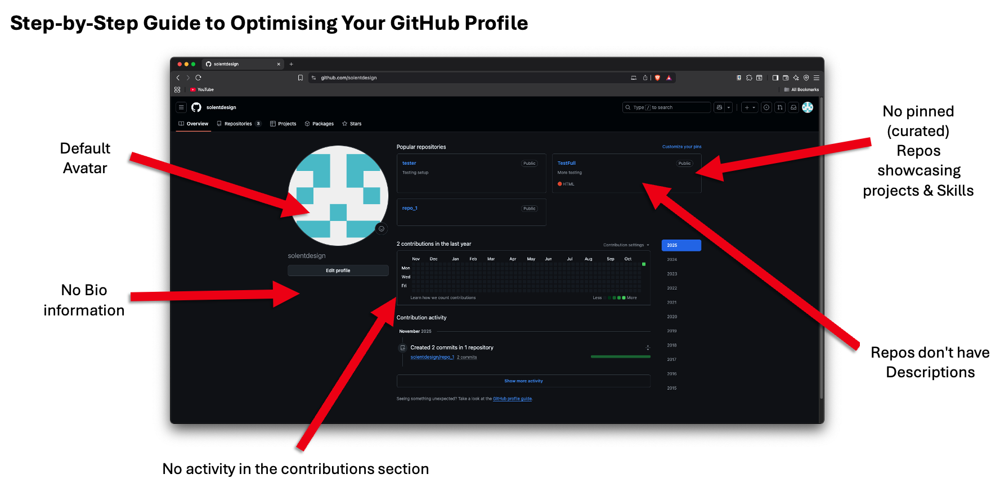

Your GitHub profile is far more than just a place to store code; it's a dynamic, professional portfolio. For potential employers, it’s a window into your skills, the projects you've built, and your passion for technology. It's ÍÍ›a powerful tool for building your career and demonstrating your enthusiasm for digital projects.

Unfortunately, it's common for students to create a profile for a module or course and then leave it incomplete. This guide will walk you through simple but powerful steps to turn that dormant profile into a compelling showcase of your talent, one that opens doors to new opportunities.

**This walkthrough assumes you already have a basic understanding of GitHub, have set up your profile, and created repositories. It also assumes you have some basic knowledge of Markdown scripting.**

### 1. The First Impression: Perfecting Your Profile Header 

The very top of your profile, your avatar, name, bio, and links, creates an immediate first impression for any visitor. Getting these details right is the first step toward a professional and compelling presence.

**1.1. Update Your Avatar -** A generic, default avatar can make a profile look incomplete. Replacing it is a small change with a big impact. Your goal is to use *something* other than the default. You have a few great options:

- **Use a professional-looking picture of yourself.** This adds a personal and human touch.

- **Use an AI-generated or cartoon picture.** If you aren't comfortable using a personal photo, this is an excellent alternative that still shows personality.

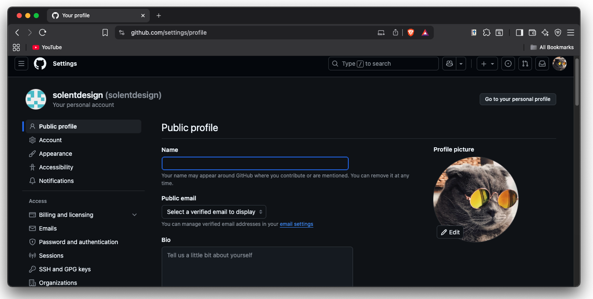

#### 1.2. Set Your Name and Write a Bio 

By default, GitHub may only display your username, which can be cryptic. Change this to your full name so visitors know who you are.

Next, write a short bio that provides essential context. It doesn't need to be long, but it should be informative. Consider including:

- **What you are studying:** Something like "Computer Science Student" is perfect. You can choose to omit your specific university if you prefer.

- **Your areas of interest:** Mention your passions within technology to give a sense of what drives you.

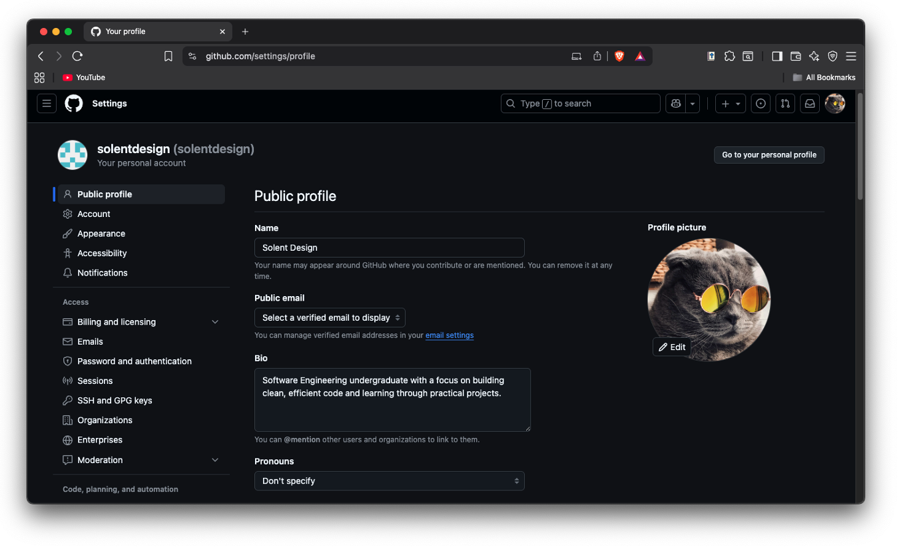

#### 1.3. Add Strategic Links 

Links are a powerful way to direct visitors to more of your work and professional presence. Be strategic about what you share.

1.  **Portfolio Website:** A personal portfolio is the best way to showcase your work in one place. You can easily create a simple portfolio website and host it for free using **GitHub Pages**.

2.  **Professional social media:** Avoid linking to private social media accounts. Instead, create professional accounts dedicated to highlighting your work, sharing what you're learning, and engaging with the tech industry.

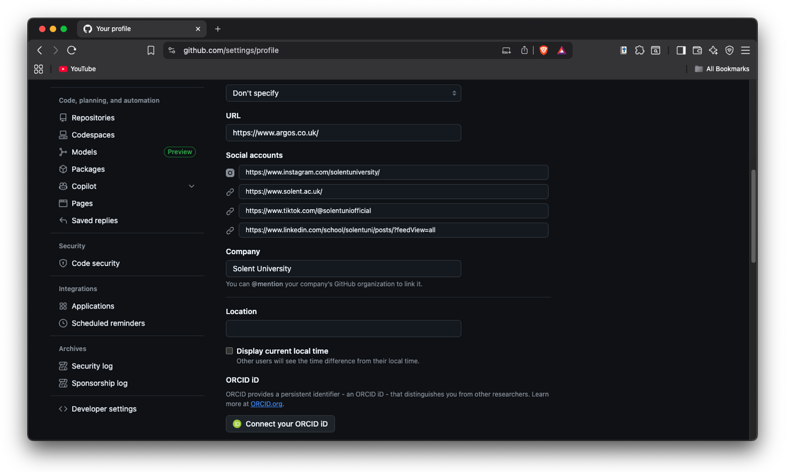

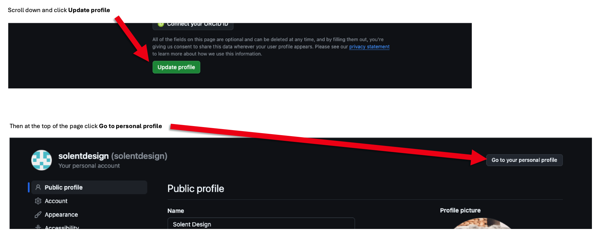

All done!

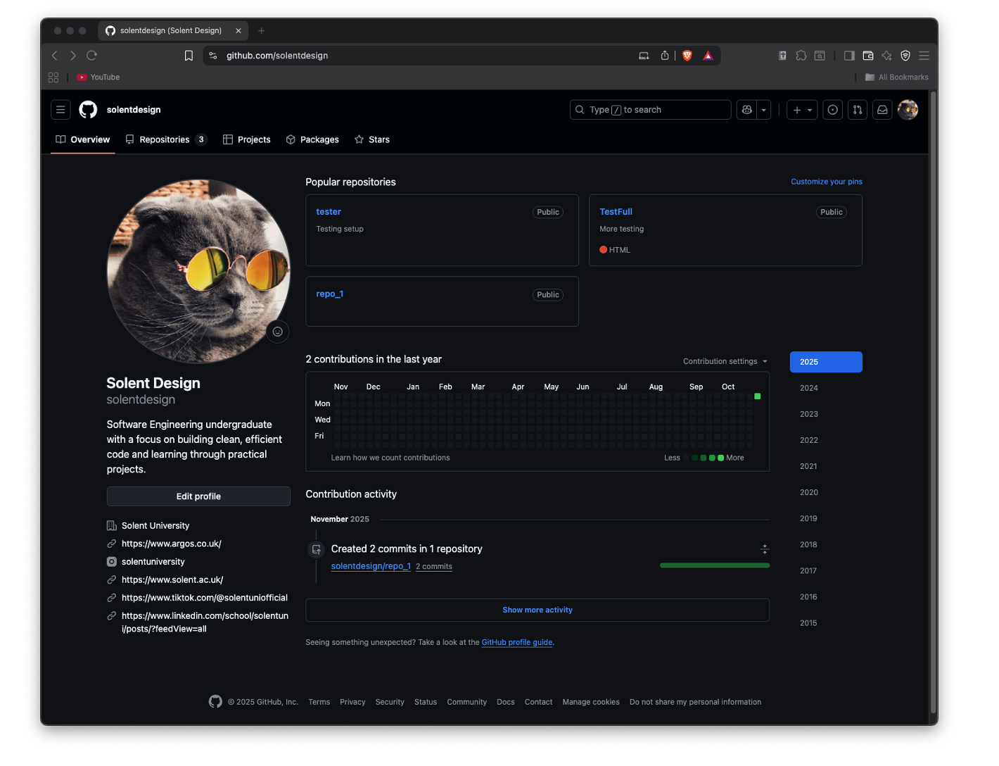

### 2. Curating Your Best Work: Pinning Repositories 

Pinning repositories allows you to take control of your profile's narrative. Instead of letting GitHub display your most popular or recent projects by default, you can hand-pick the ones that best represent your skills and ambitions.

#### 2.1. Why Pinning Matters

Pinning allows you to strategically highlight your standout projects. It’s your opportunity to curate a collection that shows a variety of your skills and tells a compelling story about your abilities, rather than just showing what's most recent.

#### 2.2. How to Select and Pin Your Projects

 Carefully choosing which projects to feature is key. Follow this strategy to build an impressive showcase:

1.  **Aim for Quality:** Choose **four to six** of your standout projects that best demonstrate your abilities.

2.  **Showcase Variety:** Select projects that highlight different skills and technologies you've worked with.

3.  **Include Side Projects:** Pinning projects, you've built outside of class is the most powerful signal you can send to employers. It shows you are **"doing more outside your class time"** and provides concrete proof that you are **"motivated and willing to learn."** Most importantly, it demonstrates **"independent learning beyond what you're doing in your modules"**, a quality that every employer is looking for.

4.  **Arrange by Importance:** After pinning your repositories, you can drag and drop them to change their order. Place your most impressive project first.

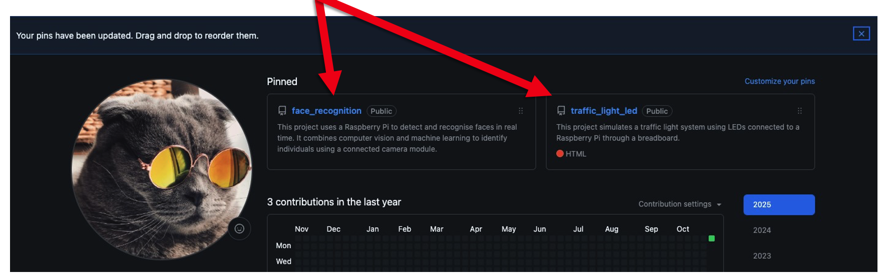

### 3. Project Polish: The Three Essentials for Every Repository 

Once a repository is pinned, it needs to be clear, professional, and easy for an outsider to understand. Every featured project should have these three essential components.

#### 3.1. Use a Meaningful Repository Name 

A project named final-project-v2 tells a visitor nothing. The repository's name should clearly reflect its content.

To change it, go to the repository's **Settings** tab and find the **Repository name** field. Update it to something descriptive, using underscores or hyphens instead of spaces (e.g., face-recognition-app).

#### 3.2. Write a Clear One-Line Description 

The short description appears directly under the repository name on your main profile page. It provides a quick summary of what the project does.

1.  Navigate to the main page of your repository.

2.  Click the small **cog icon** next to the "About" section on the right-hand side.

3.  In the **"Description"** field, write a concise, one-sentence summary of the project.

4.  Optionally, add a **"Website"** link. This is the perfect place to link to a live demo, especially if the project is hosted on GitHub Pages.

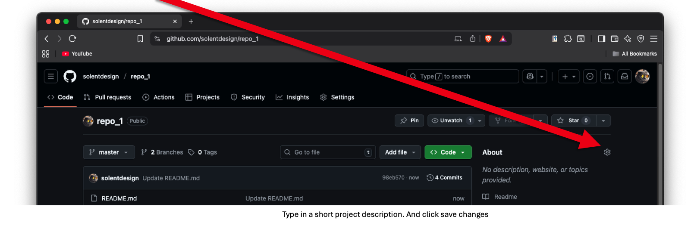

Type in a short project description. And click save changes

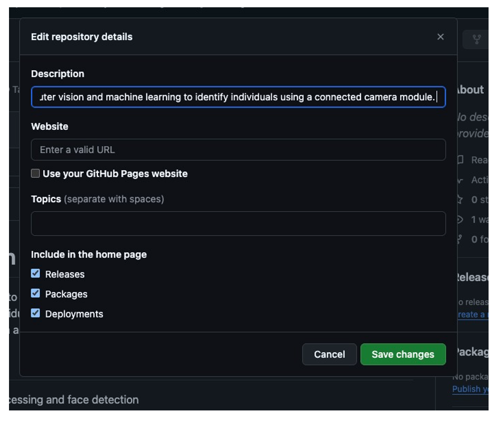

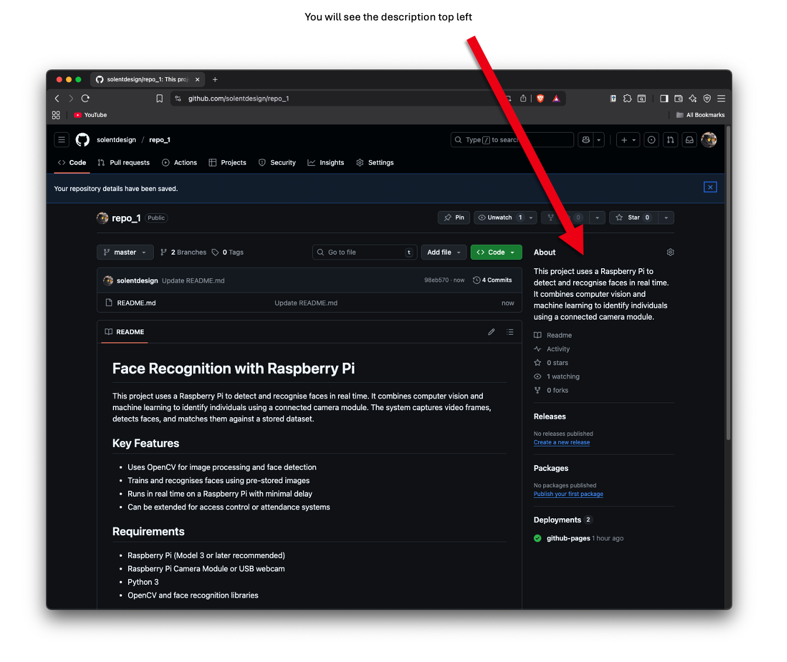

#### 3.3 Craft a Comprehensive README File 

The **README** is the most critical piece of documentation for any project. Its purpose is to tell a visitor everything they need to know, from the project's purpose to how it works. A great README makes your work accessible and impressive.

Include the following essential information:

- **What the project is about:** A clear and detailed explanation of its purpose and features.

- **Technical Information:** Details on how to run or implement the project.

- **Your Process & Reflections:** Document what you did, the challenges you faced, and what you learned. This provides invaluable insight into your problem-solving skills.

- **Visuals:** Include photos or screenshots to help visitors understand your work. For example, if you used a Raspberry Pi, include a picture of the hardware setup. You can also include screenshots of your application in action.

**Remember to write your README using GitHub Flavoured Markdown. This is a simple formatting language that is easy to learn. Look up the basics to make your documentation clean and readable.**

If you already have an existing repository, go to that repository. If you are starting with a new one, follow these steps instead. Normally, you would create and update files locally, then push them to GitHub. In this case, you will update them directly in the browser on the GitHub platform.

Click on the pencil icon to enter edit mode

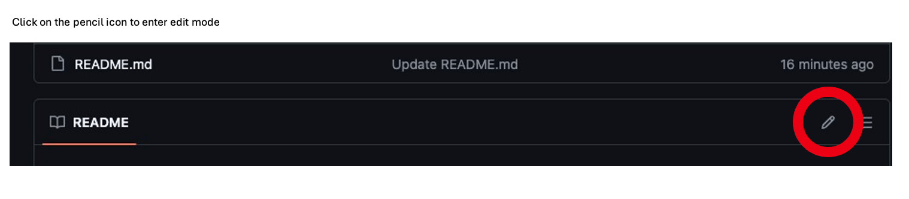

Type in your readme information in Markdown script

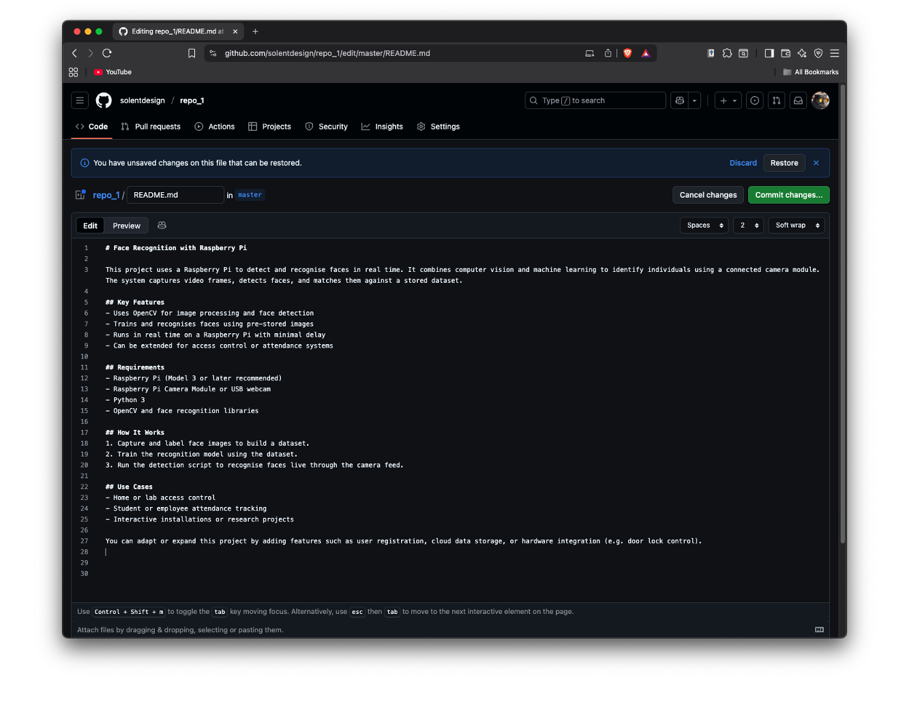

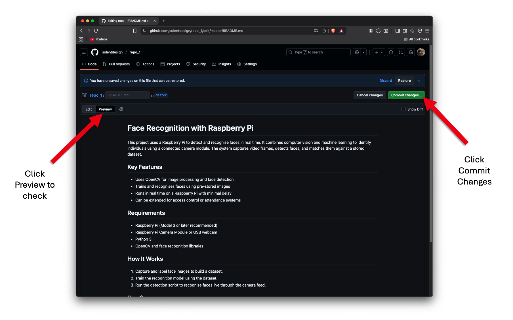

Click Commit Changes

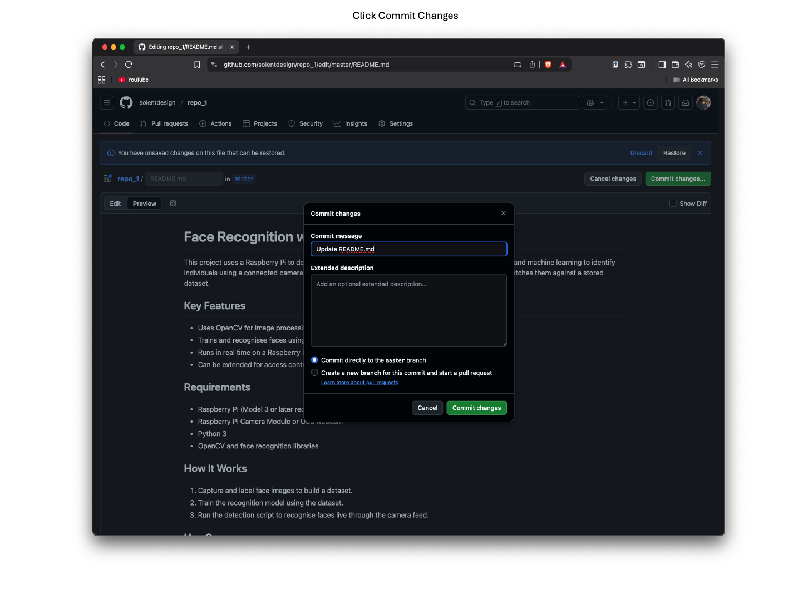

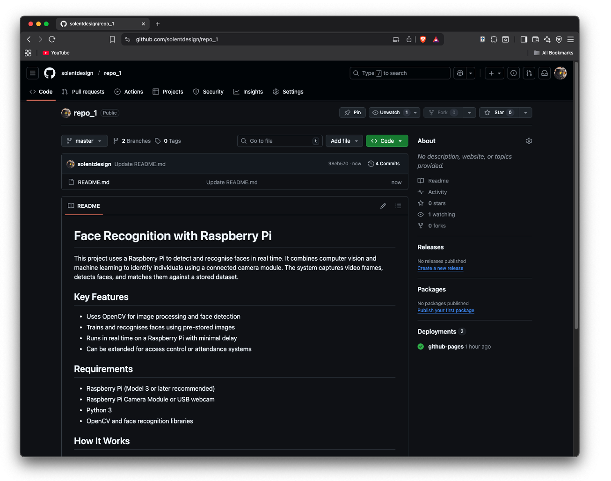

Make sure you start off with a meaningful repo name or change it later remember, repo name should be short, and they cannot have gaps between words

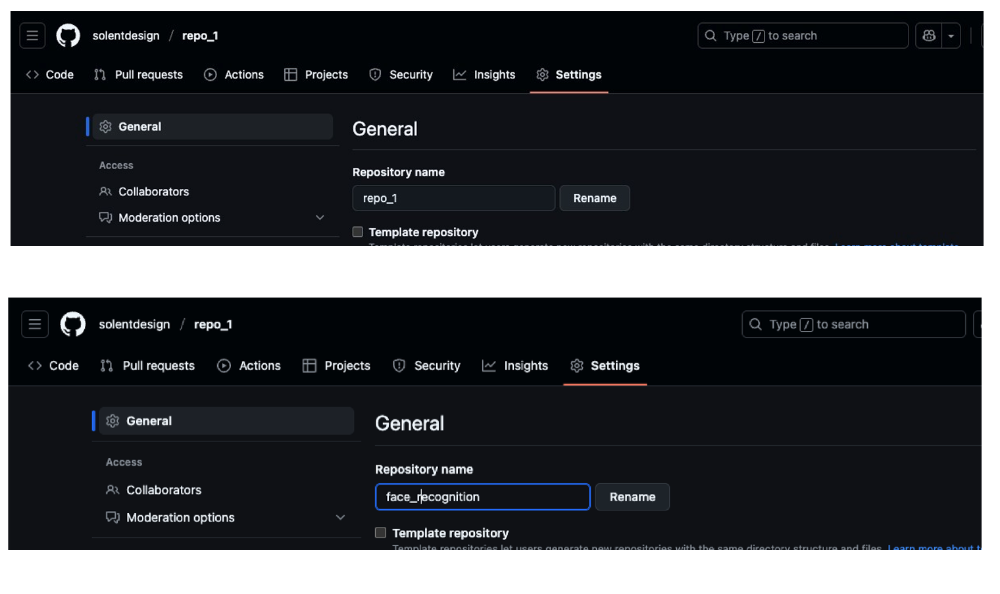

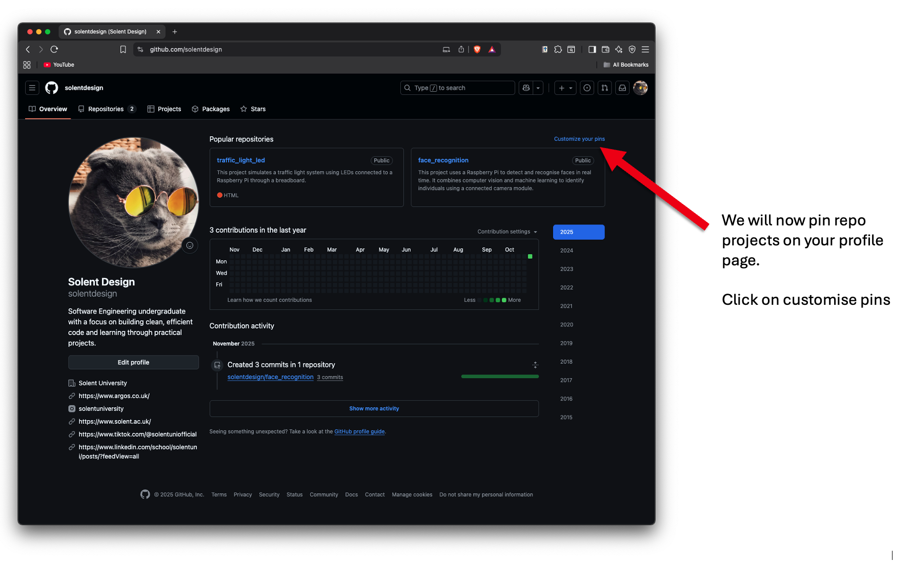

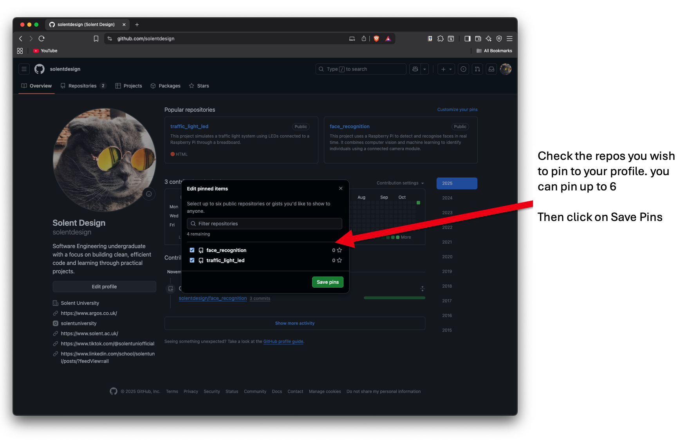

Your pinned repo projects will appear in your profile, you can drag and drop to change the order

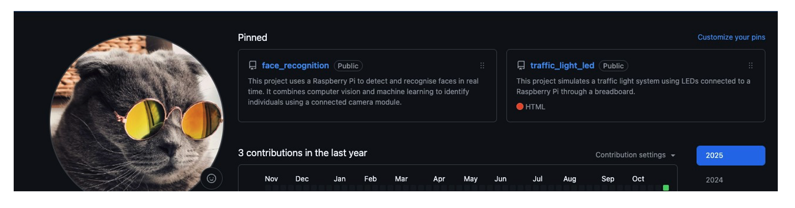

### 4. Show Your Momentum: Activity and Consistency 

A polished profile is a fantastic start, but showing consistent activity proves your ongoing engagement and passion for learning. The contribution graph is a powerful visual indicator of your dedication.

#### 4.1. Keep Your Contributions Public 

Ensure your contribution activity for public projects is visible on your profile. This activity graph shows employers how active and passionate you are. Long periods of inactivity may not look good, so it's important to showcase your ongoing work. This contribution graph is primarily populated by the work you do on public repository, making side projects the most effective way to build a compelling and consistent activity record.

#### 4.2. The Power of Side Projects 

Working on personal or "side" projects outside of required university or college work is the single best way to populate your activity graph. It is compelling evidence of your enthusiasm for technology and a key differentiator for employers. It shows them you are motivated, willing to learn, and dedicated to building skills through independent learning that goes beyond your classroom curriculum.
